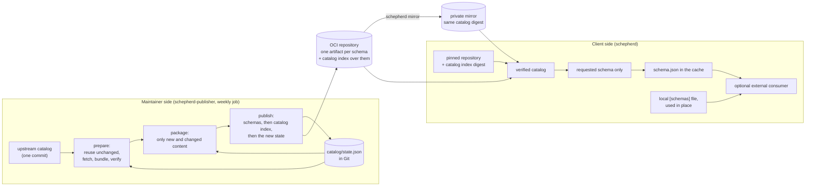
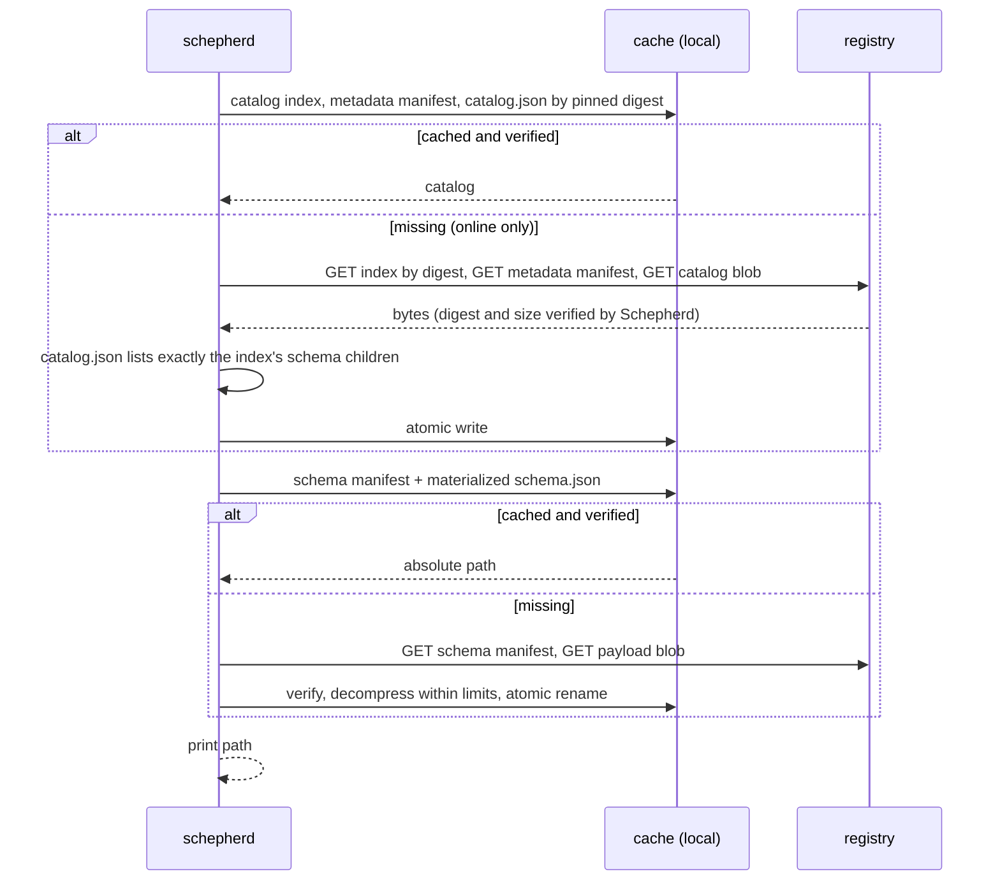

# Architecture

Schepherd has two independent halves that share one wire format.

## Invariant

Schepherd delivers a chosen JSON Schema from a pinned OCI catalog to a
verified local file. Every schema is its own artifact. The catalog moves
between registries without changing its digest. What happens with the file
afterwards is decided by the user's consumer, not by Schepherd. The catalog
is an OCI image index that references every schema artifact, so the whole
snapshot is one OCI graph that registries and generic tools follow. Schemas of
the project itself can be declared as
[local schemas](configuration.md#local-schemas): they are checked and used in
place, next to the catalog or without one, and never touch a registry or the
cache.

## What Schepherd does not do

- It does not validate documents and contains no JSON Schema engine.
- It does not parse your JSON, YAML, TOML, JSONC or JSON5 files.
- It never contacts SchemaStore or any upstream schema URL at runtime.
- It never resolves a mutable tag implicitly.
- It runs no daemon, telemetry, update check or background cache cleanup.
- It never executes anything that came from a registry.

## Packages

| Package                                                                  | Responsibility                                                                                                                                                                                                                                                                                         |
| ------------------------------------------------------------------------ | ------------------------------------------------------------------------------------------------------------------------------------------------------------------------------------------------------------------------------------------------------------------------------------------------------ |
| `cmd/schepherd`                                                          | Client entry point.                                                                                                                                                                                                                                                                                    |
| `cmd/schepherd-publisher`                                                | Maintainer entry point (not shipped to users).                                                                                                                                                                                                                                                         |
| `internal/cli`                                                           | Cobra commands, flag/env/config precedence, output discipline.                                                                                                                                                                                                                                         |
| `internal/config`                                                        | TOML loading, local `extends`, validation, precedence, local `[schemas]` and the checks of their files.                                                                                                                                                                                                |
| `internal/interp`                                                        | `${ENV}` and `{placeholder}` templates, single-pass expansion.                                                                                                                                                                                                                                         |
| `internal/match`                                                         | `fileMatch` dialect and resolution precedence.                                                                                                                                                                                                                                                         |
| `internal/catalog`                                                       | Catalog document model, strict parser, canonical encoder.                                                                                                                                                                                                                                              |
| `internal/artifact`                                                      | OCI wire contract: deterministic packing, strict manifest and index parsing, index/catalog.json cross-check.                                                                                                                                                                                           |
| `internal/registry`                                                      | ORAS-based transport: TLS, plain-HTTP opt-in, credentials, verified fetch.                                                                                                                                                                                                                             |
| `internal/cache`                                                         | Content-addressed cache, atomic materialization, inter-process locks.                                                                                                                                                                                                                                  |
| `internal/store`                                                         | Catalog and schema retrieval on top of cache and registry; strict offline. `FetchCatalog` verifies a catalog snapshot without the cache, shared by `pin`, `mirror` and the publisher.                                                                                                                  |
| `internal/mirror`                                                        | Full-snapshot, byte-preserving mirroring of the catalog's OCI graph with verification.                                                                                                                                                                                                                 |
| `internal/runner`                                                        | Planning and executing consumers (batch, per-file, stdin).                                                                                                                                                                                                                                             |
| `internal/calver`                                                        | Catalog revisions: `YYYYMMDD.HHMM` (the UTC minute of a publication) and their `catalog-<revision>` tags.                                                                                                                                                                                              |
| `internal/buildinfo`, `internal/buildinfo/semver`                        | Build information of the binaries; SemVer handling of client release versions.                                                                                                                                                                                                                         |
| `internal/digest`, `internal/jsonutil`, `internal/fault`, `internal/env` | Shared primitives.                                                                                                                                                                                                                                                                                     |
| `internal/publisher/...`                                                 | Upstream import, SSRF-safe fetching, IDs, license policy, bundling, reuse of unchanged schemas, packaging and publishing.                                                                                                                                                                              |
| `internal/publisher/state`                                               | `catalog/state.json`, the Git record of what was published (load, save, validation; `api/state.schema.json`).                                                                                                                                                                                          |
| `internal/publisher/publish`                                             | The registry-free plan shared by `diff` and `publish` (artifact reuse by content digest, metadata-only changes, held and excluded schemas, the check that a prepared set matches its state), time-based revision allocation and the publication order.                                                 |
| `internal/publisher/licensedetect`                                       | Automatic license detection for sources no rule covers (GitHub REST API, npm registry and CDNs).                                                                                                                                                                                                       |
| `internal/testutil/...`, `internal/cache/linktest`                       | Test-only helpers (in-memory OCI registry, client smoke scenario, junction and symlink setup).                                                                                                                                                                                                         |
| `tools/release`                                                          | SemVer release-tag checks (`version`, with the PyPI and RubyGems forms and the previous tag), the npm packages, PyPI wheels and RubyGems gem built with `npm pack`, `uv build` and `gem build` and their publication plans (`internal/wrappers`), license texts and notices, the workflow policy test. |
| `tools/catalogbot`                                                       | The Git side of the weekly catalog update: signed state commit, `catalog-<revision>` tag and release, release notes, job summary, status of the recorded revision, source commit rewrite.                                                                                                              |

The client binary links none of the publisher packages, none of the test-only
helpers (`internal/testutil/...`, `internal/cache/linktest`) and no JSON Schema
library. `go list -deps ./cmd/schepherd` is checked in CI (and by
`task lint:client-deps`) to keep it that way.

The client and the schema catalog are released independently: client
releases are SemVer tags `vX.Y.Z`, catalog revisions are the UTC minute of
their publication with tags `catalog-YYYYMMDD.HHMM` (see
[Versioning](versioning.md)). The weekly catalog update is described in
[Catalog automation](automation.md).

## Data flow of the weekly catalog update

`prepare` reads the upstream snapshot and `catalog/state.json`. Published
schemas whose inputs did not change are reused with their recorded artifact;
the other records are fetched, bundled, verified and license-checked, and a
published schema that cannot be refreshed is held. `publish` uploads new
artifacts only, then the catalog index over them, and writes the next state.
See [Publishing](publishing.md).

## Data flow of `schepherd path <id>`

A warm cache performs no network request of any kind: no manifest `HEAD`, no
token request, no credential helper.

## Trust model

- The pinned catalog index digest is the root of trust. Everything else is
  verified by digest and size before use: the metadata manifest,
  `catalog.json`, schema manifests, payload blobs, decompressed content.
- A digest proves integrity relative to that pin, not who published it. It is
  not a signature. Deliver the pin through a channel you trust (a reviewed
  config file).
- The runner configuration is a local, trusted, executable contract that is
  loaded only from an explicit path. Registries cannot contribute commands,
  arguments, environment variables or configuration.
- Credentials stay with the host they are configured for; they are not sent
  across redirects to other hosts, and two registry entries (a host or a
  repository prefix) never share credentials or tokens.

See [Security](security.md) for details.
