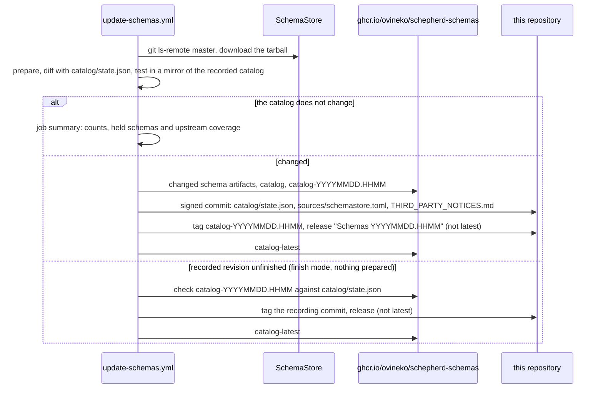

# Catalog automation

The public schema catalog updates itself. Every Monday at 03:00 UTC (GitHub
may start scheduled jobs late), and on manual dispatch,
`.github/workflows/update-schemas.yml` scans SchemaStore `master`. When the
prepared catalog differs from what `catalog/state.json` records, it publishes
the changed schemas and a new catalog revision, commits the new state to
`main`, tags and releases the revision and finally moves `catalog-latest`. A
published schema never blocks it and never disappears on its own (see
[Published schemas](publishing.md#published-schemas)). This page is for the
people who operate that job; the tool itself is described in
[Publishing](publishing.md).



## The jobs

1. **prepare** (`contents: read`, no secrets) resolves the current `master`
   commit, writes a copy of `sources/schemastore.toml` that records it
   (`catalogbot set-commit`), runs `schepherd-publisher prepare --state
catalog/state.json` (with the job's read-only `GITHUB_TOKEN` for license
   detection, and `--refresh` or `--refresh-all` from the `refresh` input) and
   `diff`, and writes the job summary. When `hasChanges` is false the run ends
   there, however many schemas are held. When the recorded revision is
   unfinished (see [Finishing an interrupted revision](#re-running)), it
   prepares nothing and hands the run to the publish job in finish mode.
2. **test** (`contents: read`, `packages: read`) mirrors the recorded catalog
   from GHCR into a throwaway local registry, because reused and held entries
   keep artifacts only the real registry holds. There it publishes the
   prepared set against the recorded state, republishes it against the state
   it wrote (a noop that leaves the state byte-identical), checks that `diff`
   reports no changes, publishes again from the recorded state (it must resume
   the same revision), runs `latest`, fetches every schema with the client and
   renders `THIRD_PARTY_NOTICES.md` for the new state. It is skipped in finish
   mode.
3. **publish** runs only on `main`, in the protected `schemas-publish`
   environment, with `contents: read`, `packages: write`, `attestations:
write` and `id-token: write`. The prepare job ran the bundler on untrusted
   upstream data, so of its `catalog-update` artifact only the prepared set is
   used, after `cmp` confirms that the artifact's `base-state.json` equals
   `catalog/state.json` of the checkout. Everything else comes from the
   checkout:
   1. `schepherd-publisher publish` (without `--update-latest`) pushes the new
      and changed schemas and the catalog, and `actions/attest` attests the
      catalog index digest, which references every schema artifact (see
      [Verifying a published catalog](security.md#verifying-a-published-catalog));
   2. `actions/create-github-app-token` creates a short-lived installation
      token of the bot's GitHub App;
   3. `catalogbot notes` renders the release notes, and `catalogbot commit`
      writes `catalog/state.json`, `sources/schemastore.toml` (rebuilt from
      the checkout by `catalogbot set-commit --state`) and
      `THIRD_PARTY_NOTICES.md` (regenerated from the checkout by
      `release notices generate --state`) to `main` as one commit through
      the GraphQL `createCommitOnBranch` mutation, so GitHub signs it;
   4. `catalogbot release` tags the commit `catalog-<revision>` and creates
      the release `Schemas <revision>`;
   5. `schepherd-publisher publish --update-latest` resumes the same revision
      and moves `catalog-latest`.

   In finish mode step 1 is `schepherd-publisher latest --check`, step 3
   renders the notes from the recorded state and finds the commit that
   recorded it, and step 5 is `schepherd-publisher latest`.

The order is fixed: registry publication, Git commit, Git tag and release,
`catalog-latest`. Every step is idempotent (see [Re-running](#re-running)).
Per-record problems never fail the job: a published schema that cannot be
refreshed is held, and a new record that fails stays out of the catalog. Only
systemic errors do: an upstream snapshot that cannot be downloaded or does
not match its digest, registry errors, GitHub API errors and invalid
configuration.

## Setting it up

A repository administrator does this once, before the workflow reaches
`main`. Publication has no switch: from then on every run on `main` that
finds a change publishes it. A publish job that runs before the setup is
complete fails and is finished by a later run.

1. **Create a GitHub App** for the bot (Developer settings, GitHub Apps). It
   needs no webhook. Repository permissions: **Contents: Read and write** and
   **Metadata: Read-only**; nothing else. Install it on this repository only.
2. **Store its Client ID** (not the numeric App ID) in the repository
   variable `SCHEPHERD_BOT_CLIENT_ID`.
3. **Create the environment `schemas-publish`** and allow only the `main`
   branch to deploy. Required reviewers are possible, but they turn every
   weekly publication into a manual approval.
4. **Store the App's private key** as the environment secret
   `SCHEPHERD_BOT_PRIVATE_KEY` of `schemas-publish` (not as a repository
   secret), so only the publish job can read it.
5. **Let the App through the rules of `main` and the tags.** Add only the App
   to the bypass list of rules that require a pull request or status checks.
   "Require signed commits" needs no bypass, because GitHub signs the commits
   the App creates through its API. Tag rules must let the App create
   `catalog-*` tags; it never updates or deletes one.
6. **Registry.** The package `ghcr.io/ovineko/schepherd-schemas` must grant
   this repository's workflows write access (the publish job pushes with its
   own `GITHUB_TOKEN`) and read access (the test job mirrors from it). Make
   the package public so clients, and the job's own anonymous
   `catalog-latest` check, can read it.

## What the bot writes

When the prepared catalog differs from the recorded state:

| Where                               | What                                                                                                                                                                                   |
| ----------------------------------- | -------------------------------------------------------------------------------------------------------------------------------------------------------------------------------------- |
| `ghcr.io/ovineko/schepherd-schemas` | the artifacts of new and changed schemas (untagged), the catalog index over them tagged `catalog-<revision>`, and at the end `catalog-latest`                                          |
| `main`                              | one commit `chore(schemas): record catalog <revision>` by the App, signed by GitHub, that writes exactly `catalog/state.json`, `sources/schemastore.toml` and `THIRD_PARTY_NOTICES.md` |
| Git tags                            | a lightweight tag `catalog-<revision>` on that commit                                                                                                                                  |
| GitHub Releases                     | `Schemas <revision>`: not marked latest, not a pre-release, not a draft                                                                                                                |

GHCR lists the schema artifacts and catalog metadata manifests as untagged
versions of the `schepherd-schemas` package; the catalog indexes reference
them. Never delete untagged versions of that package (see
[Retention](mirroring.md#retention)).

When the catalog does not change, it writes nothing. Held schemas alone do
not change the catalog. The bot never builds or releases the client.

**Release notes** give the revision and its OCI tag, the counts (`N added,
N changed, N metadata updated, N excluded, N unchanged (M of them held)`),
the catalog digest, a link to the upstream commit and "How to pin", and list
the schemas under Added, Changed, Metadata updated (same artifact, new name,
description, `fileMatch` or dialect), Held (with reason and since which
revision) and Excluded (an explicit exclude rule; the IDs stay reserved), each
section only when it is not empty. They are derived from the state alone
(see [State](publishing.md#state)).

**The job summary** of every run, also one without changes and a finish run,
gives the check time in UTC, the upstream commit, the counts, whether a
revision is published ("Held schemas alone do not make a new revision" when
only holds were found, "publication is not enabled for this run" when the
catalog changed in a run that is not on `main`), the held schemas and the
newly excluded IDs. A run that prepared upstream adds the upstream coverage
(`Upstream coverage: N records, N included (catalog entries: N, reused: N),
N excluded by a rule, N pending review, N failed`), a "Pending review" section
with the counts by reason, and a "Failed" section with every failed record's
name, URL and reason. A finish run names what the recorded revision lacks.

Upstream names appear only inside code spans, so they never render as
Markdown, HTML, mentions or links. Notes and summaries never exceed 100,000
bytes: a long section lists what fits and ends with
`- and N more not listed here` (`catalogbot notes` fails with exit code 2
rather than write longer notes). The artifacts `update-report-prepare` (the
prepare result, the records of `report.json` as `records.json`, the diff and
`summary.md`) and `update-report-publish` (the publish results, the new
state, the notes) are kept for 90 days.

## Applying a recipe or bundler change

A published schema whose inputs did not change keeps its recorded artifact
and license decision (see
[Reusing unchanged schemas](publishing.md#reusing-unchanged-schemas)). A new
Sourcemeta bundler or a change of the prepare recipe, of a notice or of the
license policy reaches such schemas only through a manual run (Actions,
"Update schemas", "Run workflow", or
`gh workflow run update-schemas.yml -f refresh=all`) with the optional input
`refresh`: space-separated schema IDs or `all`, which becomes
`--refresh=<id>` per ID or `--refresh-all`. Each ID must be a published
schema. A refreshed schema whose bytes and notice come out the same keeps its
artifact. A run that has to finish an interrupted revision first ignores the
input with a warning; run it again afterwards.

## Pausing it

- **Review every publication:** add a required reviewer to the
  `schemas-publish` environment. Each publish job then waits for approval; a
  rejected one publishes nothing, while the prepare and test jobs keep
  reporting what would change.
- **Stop everything:** disable the workflow (Actions, "Update schemas",
  "Disable workflow", or `gh workflow disable update-schemas.yml`).

Do not pause it by removing the App or its key: the publish job would then
push to the registry and fail at the commit step, leaving a revision that the
next run has to finish.

## Re-running

- **Re-run the failed jobs** of a run to finish it with the same prepared
  set: the registry publication resumes its revision, `catalogbot commit`
  returns the commit that already recorded identical contents, and
  `catalogbot release` accepts an existing tag on the same commit and an
  existing release (a tag on another commit is refused). The `catalog-update`
  artifact is kept for 7 days; after that, start a new run.
- **Start a new run** (Actions, "Update schemas", "Run workflow", or
  `gh workflow run update-schemas.yml`).

**Finishing an interrupted revision.** When a run stopped after the state
commit, the next run finds the recorded revision without its Git tag, its
release or `catalog-latest` (`catalogbot status`; `catalog-latest` is read
anonymously and counts as unknown, never missing, when that fails). It then
prepares and publishes nothing: `schepherd-publisher latest --check` verifies
that `catalog-<revision>` names exactly the recorded catalog, and the publish
job tags, releases and moves `catalog-latest` from `catalog/state.json`
alone, however much upstream changed since. Newer upstream changes wait for
the following run.

| A run stopped at         | Result                                                  | What happens next                                                                                                                                                                                                            |
| ------------------------ | ------------------------------------------------------- | ---------------------------------------------------------------------------------------------------------------------------------------------------------------------------------------------------------------------------- |
| prepare or test          | nothing published                                       | the next run tries again; this is a systemic error such as an unreachable upstream, registry or GitHub API                                                                                                                   |
| the registry publication | schema artifacts, maybe a catalog without state in Git  | a re-run or the next run resumes the revision when the content is the same, otherwise publishes a later minute; an orphaned revision is never made `catalog-latest`                                                          |
| the state commit         | revision published in the registry, not recorded in Git | a re-run commits it; when `catalog/state.json`, `sources/schemastore.toml` or `THIRD_PARTY_NOTICES.md` changed on `main` since the run started (exit code 5), nothing is committed and the next run starts from the new head |
| the tag or the release   | state committed, revision not tagged or released        | the next run finishes it from the recorded state                                                                                                                                                                             |
| `catalog-latest`         | everything but `catalog-latest`                         | the next run finishes it when `catalog-latest` can be read anonymously; otherwise re-run the failed job, or the next publication moves it                                                                                    |

`THIRD_PARTY_NOTICES.md` changes with every client dependency or license rule
change it shows, so a change merged during a run can make the state commit
wait for the next run.

The publish job stops before publishing anything with
`the prepared update was not compared with catalog/state.json of <sha>` or
`the prepared update carries a state, but <sha> records none` when the
`catalog-update` artifact does not match its checkout. Both jobs check out
the same commit, so treat this as possible tampering with the artifact,
investigate, and start a new run of the whole workflow.

## What needs a human

- **License review of pending sources.** Every source that neither a license
  rule nor [automatic detection](publishing.md#automatic-license-detection)
  allows stays `pending-review` and is not published. The job summary counts
  them by reason; the records are in `records.json` of the
  `update-report-prepare` artifact. Allowing, excluding or holding one is a
  reviewed change of `sources/licenses.toml`; the next weekly run publishes
  what it newly allows.
- **Schemas held for a long time.** A hold never breaks the catalog, but one
  that does not end, such as `license-refused` after a relicensing or
  `prepare-failed` after an upstream change the bundler cannot handle,
  deserves a look: keep it, fix the cause, or exclude the schema.
- **Takedown requests.** An explicit `exclude` rule in
  `sources/licenses.toml` is the only way a published schema leaves the
  catalog. The rule must match the schema's `provenance.source`, which for a
  SchemaStore file is `https://www.schemastore.org/<file>.json` (other
  SchemaStore spellings in `urls` are refused when the policy loads), or name
  the file with `file_names` on the SchemaStore hosts.
- **Refused draft-07 sibling cases.** SchemaStore files whose draft-04/06/07
  top-level `$ref` has siblings that constrain instances fail as
  `top-level-ref-draft7` every week; only an upstream change resolves them.
- **A finish run whose registry does not hold the recorded catalog.**
  `schepherd-publisher latest --check` exits with code 5 before anything is
  tagged when `catalog-<revision>` is missing, names another index, or
  lists other entries than `catalog/state.json`: the registry lost or changed
  the revision, or the state was edited by hand. Every following run stops
  the same way until a maintainer restores one or the other.
- **Dependency and toolchain updates** (see
  [CONTRIBUTING.md](https://github.com/ovineko/schepherd/blob/main/CONTRIBUTING.md#dependency-and-pin-updates)).
  A bundler upgrade reaches published schemas only with the `refresh` input.
  A Go toolchain upgrade changes no published artifact, because unchanged
  content keeps its recorded artifact.
- **Expiring lint suppressions**, such as the Dockerfile rules of the
  validators test image, which expire on 2026-12-20.

## catalogbot

`tools/catalogbot` is the Git side of the weekly update; it never talks to an
OCI registry. `go run ./tools/catalogbot <command>`:

| Command                                                                                                  | Does                                                                                                                                                                                                                 |
| -------------------------------------------------------------------------------------------------------- | -------------------------------------------------------------------------------------------------------------------------------------------------------------------------------------------------------------------- |
| `set-commit --source F (--commit SHA \| --state S [--commit SHA]) --out G`                               | Copies `F` with only its top-level `commit = "…"` line changed. With `--state` the commit is the SchemaStore commit that `S` records; given both, they must agree (exit code 5 otherwise).                           |
| `status --repo OWNER/NAME --state F [--latest-digest D] [--json]`                                        | Reports whether the revision recorded in `F` lacks its tag, release or `catalog-latest` (`{recorded, revision, catalogDigest, tag, release, latest, missing[], pending}`); an empty `--latest-digest` means unknown. |
| `notes --state F --repository HOST/PATH [--result PUBLISH_JSON] [--out G]`                               | Renders the release notes from the state. With `--result`, the publish result must describe the same revision, digest and changes (exit code 5 otherwise).                                                           |
| `summary --checked-at T --diff F --report R --upstream SHA [--publish=false] [--out G]`                  | Renders the job summary of a run that prepared upstream from the `diff --json` result and `report.json`, both checked strictly (exit code 2 otherwise).                                                              |
| `summary --checked-at T --state F --status S [--out G]`                                                  | Renders the job summary of a finish run from the state and the `status --json` result.                                                                                                                               |
| `commit --repo OWNER/NAME --branch B --expected-head SHA --message-file F --file PATH=LOCAL... [--json]` | Writes the files as one GitHub-signed commit; the first `--file` identifies an existing recording commit.                                                                                                            |
| `release --repo OWNER/NAME --revision YYYYMMDD.HHMM --commit SHA --notes F [--json]`                     | Creates the tag and the release.                                                                                                                                                                                     |

Environment: `GH_TOKEN` (required by `commit` and `release`, optional for
`status`, redacted from every line), `GITHUB_API_URL` and
`GITHUB_GRAPHQL_URL` (HTTPS only, except loopback addresses in tests). Exit
codes: 0 success, 1 internal error, 2 usage, 3 not found, 4 GitHub API or
network failure, 5 conflict (a tag on another commit, files changed under
the commit).

## Consuming new catalogs

A pinned catalog digest never changes, so nothing changes for users until
they update their pin:

```bash
schepherd pin ghcr.io/ovineko/schepherd-schemas:catalog-latest               # the newest revision
schepherd pin ghcr.io/ovineko/schepherd-schemas:catalog-20260928.0300        # one specific revision
```

`pin` prints a `[catalog]` section to paste into `schepherd.toml` (see
[`pin`](cli.md#catalog-and-discovery)). To be told about new revisions, watch
the repository's releases (Watch, Custom, Releases). Catalog releases are
never marked latest, so the repository's latest release stays the client. To
list only the catalog releases:

```bash
gh release list --repo ovineko/schepherd --json tagName,publishedAt \
  --jq '.[] | select(.tagName | startswith("catalog-"))'
```
