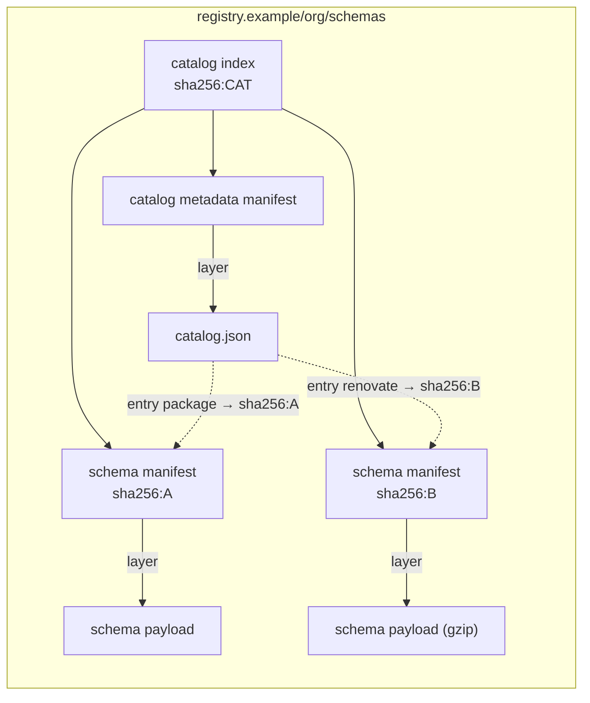

# OCI wire format (version 2)

This page is the normative contract between the Schepherd publisher, OCI
registries and the `schepherd` client. The media types below are project
conventions; apart from `application/schema+json` none of them is an IANA
registration.

## One repository, many artifacts

A schema set lives in **one** OCI repository, for example
`registry.example/org/schemas`. Inside it:

- every logical JSON Schema is its **own** artifact (one OCI image manifest);
- the catalog is an OCI **image index** whose children are one catalog
  metadata manifest, which holds `catalog.json` (schema IDs, metadata and the
  manifest descriptors of the schema artifacts), and every distinct schema
  manifest.



The solid arrows are OCI descriptor edges: registries, garbage collectors and
generic tools such as `oras cp` follow them from the index to every schema
artifact, so the whole snapshot is one OCI graph. The dotted arrows are the
references **inside `catalog.json`** that the client resolves IDs with. Both
must describe the same set of schema manifests (see
[Catalog index](#catalog-index)).

Catalog entries never contain a registry host or repository name. A client
resolves every entry against the repository it fetched the catalog from. This
is what allows a byte-identical copy of the whole set to live in another
registry under the same catalog digest.

## Addressing

A client needs exactly two values:

```text
repository = registry.example/org/schemas
catalog    = sha256:<64 lowercase hex digits>   # digest of the catalog index
```

A digest alone is not enough: it identifies content, not a location. Only
`sha256` is supported in version 2; any other algorithm is rejected as
unsupported.

## Digests: which is which

| Name                   | Hash of                                        | Where it appears                                        |
| ---------------------- | ---------------------------------------------- | ------------------------------------------------------- |
| catalog digest         | catalog **index** bytes                        | configuration `catalog.digest`, `pin`, `mirror`         |
| schema manifest digest | schema **manifest** bytes                      | `artifact.digest` in each catalog entry, index children |
| payload (blob) digest  | bytes of a layer as stored in the registry     | layer descriptors (gzip bytes for compressed schemas)   |
| content digest         | uncompressed schema JSON (`schema.json` bytes) | layer annotation `com.ovineko.schepherd.content.digest` |
| source digest          | upstream bytes before preparation              | `provenance.sourceDigest` (informational)               |

For an uncompressed payload the content digest equals the payload digest.

## Schema artifact

```json
{
  "schemaVersion": 2,
  "mediaType": "application/vnd.oci.image.manifest.v1+json",
  "artifactType": "application/vnd.ovineko.schepherd.schema.v2",
  "config": {
    "mediaType": "application/vnd.oci.empty.v1+json",
    "digest": "sha256:44136fa355b3678a1146ad16f7e8649e94fb4fc21fe77e8310c060f61caaff8a",
    "size": 2,
    "data": "e30="
  },
  "layers": [
    {
      "mediaType": "application/schema+json",
      "digest": "sha256:…",
      "size": 17,
      "annotations": {
        "com.ovineko.schepherd.content.digest": "sha256:…",
        "com.ovineko.schepherd.content.size": "17",
        "org.opencontainers.image.title": "schema.json"
      }
    }
  ]
}
```

Rules enforced by the client (`internal/artifact`):

- `schemaVersion` is 2, `mediaType` is the OCI image manifest type and
  `artifactType` is `application/vnd.ovineko.schepherd.schema.v2`.
- The wire format version is checked before the remaining rules. A manifest
  whose `artifactType` is a Schepherd type of the expected kind with a newer
  version (for example `application/vnd.ovineko.schepherd.schema.v3` where a
  schema is expected), or that has any layer media type of the form
  `application/vnd.ovineko.schepherd.<schema|catalog|catalog-metadata|notice>.v<N>[+suffix]`
  with N greater than 2 (for example `…schema.v3+gzip`, `…catalog.v3+json`,
  `…notice.v3+text`), is refused as an unsupported format with exit code 2.
  The message reads "unsupported artifact format: … is Schepherd wire format
  vN, but this client is too old and reads only v2; upgrade schepherd".
  Anything else stays an invalid artifact (exit code 5): a Schepherd type of
  another kind (a catalog where a schema is expected), older versions (v1 was
  never published), version 0 or leading zeros, other letter case, unknown
  kinds, foreign types, and v2 types with an unknown suffix.
- `config` is exactly the OCI empty JSON descriptor.
- The first layer is the only schema payload, with media type
  `application/schema+json` (uncompressed) or
  `application/vnd.ovineko.schepherd.schema.v2+gzip` (a raw gzip stream of the
  JSON, **not** a tar archive).
- An optional second layer with media type
  `application/vnd.ovineko.schepherd.notice.v2+text` carries license notices.
  No other layer is accepted.
- The payload layer carries the content digest and decimal content size of the
  uncompressed schema. The size bounds decompression; the digest is verified
  after decompression.
- Layers must not declare `urls` or embed `data`; `subject` is not allowed;
  unknown manifest members are rejected; duplicate JSON keys are rejected.
- Annotations such as `org.opencontainers.image.title` (`schema.json`, or
  `schema.json.gz` for a gzip payload) are informational. The
  client never uses them to build file names: the materialized file is always
  called `schema.json`.

## Catalog index

The pinned catalog is an OCI image index:

```json
{
  "schemaVersion": 2,
  "mediaType": "application/vnd.oci.image.index.v1+json",
  "artifactType": "application/vnd.ovineko.schepherd.catalog.v2",
  "manifests": [
    {
      "mediaType": "application/vnd.oci.image.manifest.v1+json",
      "digest": "sha256:…",
      "size": 391,
      "artifactType": "application/vnd.ovineko.schepherd.catalog-metadata.v2"
    },
    {
      "mediaType": "application/vnd.oci.image.manifest.v1+json",
      "digest": "sha256:…",
      "size": 512
    }
  ]
}
```

The publisher writes the metadata manifest first, then every distinct schema
manifest the catalog lists, in ascending digest order and without
duplicates. It writes no annotations, no `subject` and no `platform`, so the
same catalog always gives the same index digest.

Rules enforced by the client (`internal/artifact`):

- The index is at most `limits.max_manifest_bytes`; its JSON is strict
  (unknown members and duplicate keys are rejected).
- `schemaVersion` is 2, `mediaType` is the OCI image index type and
  `artifactType` is `application/vnd.ovineko.schepherd.catalog.v2`. `subject`
  is not allowed. Annotations on the index itself are informational.
- Children never carry `urls`, `data`, `platform` or `annotations`, and no
  digest appears twice.
- Exactly one child has `artifactType`
  `application/vnd.ovineko.schepherd.catalog-metadata.v2`: the catalog
  metadata manifest, an OCI image manifest.
- Every other child is a schema manifest descriptor: no `artifactType`, the
  OCI image manifest media type and a size from 1 to
  `limits.max_manifest_bytes`.
- The wire format version is checked first: an index `artifactType` or a
  child `artifactType` of a newer Schepherd wire format (for example
  `…catalog.v3` or `…catalog-metadata.v3`) is refused as unsupported (exit
  code 2); any other violation is an invalid artifact (exit code 5).

The client then fetches the metadata manifest by its descriptor (digest and
size verified), then `catalog.json` by the layer descriptor, and parses the
catalog document. The distinct `artifact` descriptors of `catalog.json` must
be exactly the schema children of the index, with equal digests, sizes and
media types. Any mismatch in either direction is an invalid artifact (exit
code 5), from the registry as well as from the cache. Only the schema
manifests of the IDs a command needs are fetched after that.

## Catalog metadata artifact

Same envelope as a schema artifact with `artifactType`
`application/vnd.ovineko.schepherd.catalog-metadata.v2` and exactly one layer
of media type `application/vnd.ovineko.schepherd.catalog.v2+json`, titled
`catalog.json` (uncompressed, so bootstrapping needs no decompression), at
most `limits.max_catalog_bytes`. The wire format version is checked first in
the same way: an `artifactType` such as
`application/vnd.ovineko.schepherd.catalog-metadata.v3`, or a layer media
type of a newer Schepherd wire format version, is refused as unsupported
(exit code 2); any other violation is an invalid artifact (exit code 5).

An index or manifest of a newer wire format found in the local cache
(written there by a newer client sharing the cache directory) is reported
the same way, with or without `--offline`. It is not treated as corrupt: it
is never quarantined and never fetched again.

## Catalog document

The JSON Schema of the document is [`api/catalog.schema.json`](https://github.com/ovineko/schepherd/blob/main/api/catalog.schema.json).

```json
{
  "formatVersion": 2,
  "revision": "20260923.1200",
  "schemas": [
    {
      "id": "package",
      "name": "package.json",
      "description": "NPM configuration file",
      "dialect": "http://json-schema.org/draft-07/schema#",
      "fileMatch": ["package.json"],
      "artifact": {
        "mediaType": "application/vnd.oci.image.manifest.v1+json",
        "digest": "sha256:…",
        "size": 512
      },
      "provenance": {
        "source": "https://json.schemastore.org/package.json",
        "sourceDigest": "sha256:…",
        "license": "Apache-2.0",
        "dependencies": [
          { "source": "https://json.schemastore.org/base.json", "digest": "sha256:…" }
        ]
      }
    }
  ]
}
```

- `formatVersion` must be `2`. Once the document is well-formed JSON (UTF-8,
  valid syntax, unique member names), another positive integer version (1,
  or 3 and later) is refused before anything else is inspected, with exit
  code 2 (unsupported format). A missing or non-integer `formatVersion` is an invalid artifact
  (exit code 5).
- `revision` is the catalog revision `YYYYMMDD.HHMM`, the UTC minute of the
  publication: a real date from 2000 to 9999 and a time from 00:00 to 23:59
  (see [Versioning](versioning.md#catalog-revisions)). Any other form is an
  invalid artifact (exit code 5).
- `schemas` is sorted by `id` in strictly ascending byte order; IDs are unique
  and match `^[a-z0-9](?:[a-z0-9._-]{0,126}[a-z0-9])?$` without `..`.
- `artifact` describes the schema **manifest**. Entries that list the same
  digest must agree on its size, and the distinct descriptors must be exactly
  the schema children of the catalog index.
- `fileMatch` is optional. Schemas without it are reachable by ID only.
- `provenance` is informational. Its URLs are never used for downloads. It
  never contains credentials, local paths or timestamps.
  `provenance.dependencies` is sorted by `source` without duplicates.
- `fileMatch` patterns must be valid in the [matching dialect](matching.md).
- Size limits: `name` 512 bytes, `description` 8192, a pattern 1024 and at most
  256 per entry, `license` 256, URIs 4096, at most 1024 dependencies.
- Unknown members are rejected; new members require a new `formatVersion`.
  `null` values and empty optional strings or arrays are rejected.
- Single-line text (`name`, `license`, patterns) must not contain control,
  bidirectional or line/paragraph separator characters.
- The canonical encoding written by the publisher sorts entries by `id` and
  object members by name at every level, without HTML escaping or
  insignificant whitespace. The client accepts any member order.

## Packing recipe `schepherd-pack/1`

Given the same prepared schema and notice bytes, the publisher always produces
the same payload bytes and the same manifest digest:

1. The prepared schema is compact JSON (insignificant whitespace removed
   without re-encoding numbers or strings).
2. Schemas shorter than 4096 bytes are stored uncompressed.
3. Longer schemas are gzip-compressed with Go's `compress/gzip` at best
   compression, zero modification time and no file name or comment; the gzip
   payload is used only if it is at least 10 % smaller.
4. A notice, when present, is appended as a second layer
   (`application/vnd.ovineko.schepherd.notice.v2+text`, title `NOTICE`); see
   [Notice layer](#notice-layer).
5. Manifests contain no `created` annotation, no timestamps and no host or
   commit information.

The recipe is independent of the wire format version: wire format 2 changed
the `artifactType` and media types written into the manifest, not these
steps. A change to any of these steps changes artifact bytes, and so can a Go
toolchain upgrade, because Go does not keep the output of `compress/flate`
stable across releases. That affects only artifacts packed afterwards: the
publisher keeps the published artifact of unchanged content (see
[Artifact reuse](publishing.md#artifact-reuse)). Golden tests in
`internal/artifact` and `testdata/catalogs` make any change visible.

### Notice layer

The notice layer is UTF-8 text: the notices of the license rules involved
(for SchemaStore documents the rule's notice followed by the SchemaStore
repository's `LICENSE` and `NOTICE` files) and, for licenses found by
automatic detection, a header naming the GitHub repository and ref or the npm
package and version and the SPDX identifier, followed by the license text
and, for Apache-2.0, the `NOTICE` file text (see
[Automatic license detection](publishing.md#automatic-license-detection)).
Parts are separated by blank lines and the text ends with one newline.
Identical text gives an identical blob, so schemas from the same source share
one notice blob. The notice is part of the published content: a new notice
text for unchanged schema bytes gives the schema a new artifact (see
[Artifact reuse](publishing.md#artifact-reuse)).

The client does not need the notice to materialize a schema. Only
`schepherd export` fetches it (by its descriptor, digest and size verified,
and cached like every other blob) and writes it next to the exported schema
as `<destination>.NOTICE` (see [Getting schemas](cli.md#getting-schemas)).

## Tags

| Tag                       | Points to                | Mutability                                 |
| ------------------------- | ------------------------ | ------------------------------------------ |
| `catalog-<YYYYMMDD.HHMM>` | one catalog index        | immutable by policy; collisions are errors |
| `catalog-latest`          | the newest catalog index | mutable discovery pointer, used by `pin`   |

These are the only tags. Schema artifacts, the metadata manifest and
`catalog.json` are kept alive by the index that references them, not by tags
of their own (see [Retention](mirroring.md#retention)).

Runtime commands never resolve tags. Only `schepherd pin` turns a tag into a
digest, once, on explicit request.

## Limits

| Limit                            | Default | Configuration key            |
| -------------------------------- | ------- | ---------------------------- |
| manifest or catalog index size   | 4 MiB   | `limits.max_manifest_bytes`  |
| catalog payload size             | 32 MiB  | `limits.max_catalog_bytes`   |
| catalog entries                  | 20000   | `limits.max_catalog_entries` |
| schema payload layer (as stored) | 64 MiB  | `limits.max_payload_bytes`   |
| decompressed schema              | 64 MiB  | `limits.max_schema_bytes`    |

The notice layer is limited to 1 MiB (not configurable). Every catalog entry's
manifest size must also fit `limits.max_manifest_bytes`. Limits can be lowered
or raised but never disabled.

The catalog index is a manifest too, so `limits.max_manifest_bytes` bounds
it. Its default of 4 MiB is the size the OCI distribution specification
recommends registries to accept at least, and the cap of the reference
registry: do not raise it, because registries refuse larger manifests. A
schema descriptor takes about 154 bytes of the index, so about 27,000
distinct schema artifacts fit; the default `limits.max_catalog_entries` of
20000 keeps an index at about 3 MiB. The publisher refuses to build an index
larger than 4 MiB, and a catalog that must list more schema artifacts cannot
be published in this format.
